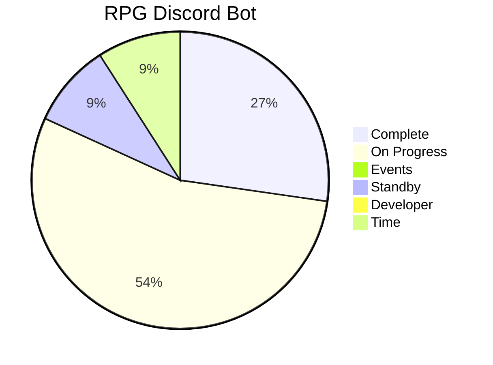
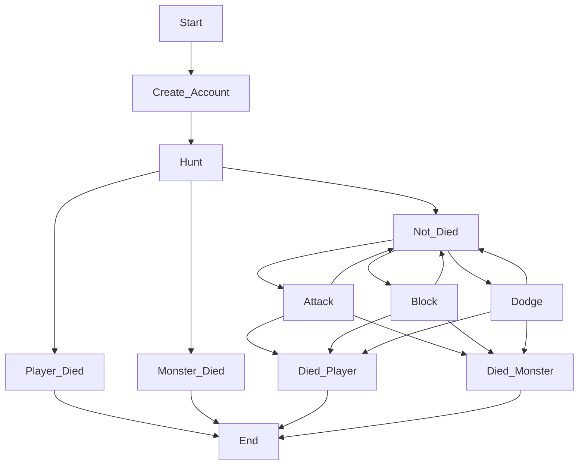

```mermaid
pie
    title RPG Discord Bot
    "Complete" : 30
    "On Progress" : 60
    "Events" : 0
    "Standby" : 10
    "Developer" : 1
    "Time" : 10
```
Work Flow: Hunt

```mermaid
graph TD;
    Start --> Create_Account
    Create_Account --> Hunt
    
    Hunt --> Player_Died
    Player_Died --> End
    
    Hunt --> Monster_Died
    Monster_Died --> End
    
    Hunt --> Not_Died
    
    Not_Died --> Attack
    Attack --> Died_Player
    Attack --> Died_Monster
    Attack --> Not_Died
    
    Not_Died --> Block
    Block --> Died_Player
    Block --> Died_Monster
    Block --> Not_Died
    
    Not_Died --> Dodge
    Dodge --> Died_Player
    Dodge --> Died_Monster
    Dodge --> Not_Died
    
    Died_Player --> End
    Died_Monster --> End
```

Work Flow: Adventure

```mermaid
graph TD;
    Start --> Create_Account
    Create_Account --> Adventure
    
    Adventure --> Player_Died
    Player_Died --> End
    
    Adventure --> Monster_Died
    Monster_Died --> End
    
    Adventure --> Not_Died
    
    Not_Died --> Attack
    Attack --> Died_Player
    Attack --> Died_Monster
    Attack --> Not_Died
    
    Not_Died --> Block
    Block --> Died_Player
    Block --> Died_Monster
    Block --> Not_Died
    
    Not_Died --> Dodge
    Dodge --> Died_Player
    Dodge --> Died_Monster
    Dodge --> Not_Died
    
    Died_Player --> End
    Died_Monster --> End
```

 
 

